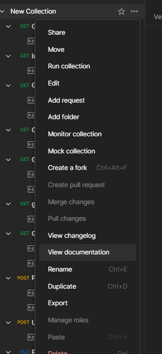

# Networks Lab 2 - REST API
## Setup

Install [docker](https://docs.docker.com/get-docker/) and [docker-compose](https://docs.docker.com/compose/install/). 

Run `docker compose up -d` inside the directory where this file at.

Now you can send HTTP request via [http://127.0.0.1:8000/](http://127.0.0.1:8000/)

Note that mySQL server takes some time on start up.
## Route and Expected Request
First, import `example.postman_collection.json` to Postman. examples and documentation on each endpoint can be found in the documentation in Postman, under `New Collection -> ... -> view documentation` .

## Possible Issue 
1. Due to the structure of the connection class, error occured on connection startup between mySQL and FastAPI is hard to be caught without abusing `try..except..`

## Idempotent Route
Note that `"/"` route is a idempotent route as it only return hardcoded content, thus response remain unchanged. 
